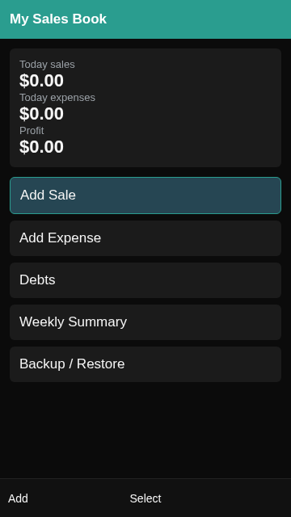

# My Sales Book (KaiOS)

Offline Sales & Cash Ledger for Micro-Merchants



## Part 1 — Business concept (what the app is, why it matters, and how it works)

### 1. The problem this app solves

Many merchants already have a phone, but still manage business with:

- cash-in-hand bookkeeping
- paper notebooks
- mental tracking of who owes what

This creates daily pain:

- no clear “did I profit today?”
- informal credit becomes disputes
- records get lost, wet, or forgotten
- phone loss destroys any digital notes if not backed up

My Sales Book is not trying to change how commerce works. It supports the way it already works — cash and trust-based credit — and makes it legible and repeatable.

### 2. Target users

- kiosk operators
- market sellers
- small neighborhood shops
- micro service providers (repairs, tailoring, phone accessories)
- anyone running a small cash ledger on paper

KaiOS is ideal for this user: a keypad phone with long battery life, low data usage, and SMS as a reliable channel.

### 3. What the user does daily (core workflow)

The app is intentionally “boring” and fast. It avoids long forms and complicated dashboards.

**Home screen answers one question:**

> “Did I make money today?”

It shows:

- today total sales
- today total expenses
- today profit (big number)

**Daily actions take seconds**

- **Add Sale**
  - type amount
  - optional short note
  - save
- **Add Expense**
  - type amount
  - optional category/note
  - save

**Weekly view**

The app shows a 7-day roll-up to reveal patterns:

- which days are strongest
- whether expenses are eating profit
- whether sales are stable or dropping

### 4. Informal credit (debts) and SMS reminders

A large part of micro-commerce runs on informal credit.

**Debt tracking**

- record a debtor name
- optionally record a phone number
- record amount owed
- see open debts list

**SMS reminder**

- from debt details, send a polite reminder by SMS
- the app logs when reminders were sent
- this record helps reduce disputes (“I reminded you on…”) without aggression

### 5. Backup and recovery (survive phone loss)

Most micro-merchants can’t afford to lose records.

My Sales Book provides an offline-first safety mechanism:

- export your ledger into an encoded SMS “backup”
- send it to your own number or trusted number
- restore later by importing the backup text

This avoids the need for:

- internet
- cloud accounts
- email
- complicated setup

Privacy note: SMS is not a private storage system. Backups should be sent only to trusted numbers.

### 6. Why this is not a fintech app

My Sales Book is:

- not a bank
- not payments
- not lending
- not identity verification
- not credit scoring

It’s a practical notebook replacement for daily trade.

### 7. Distribution strategy (how it gets into real hands)

Primary channel: KaiStore

- publish as a KaiOS app so merchants can install easily

**Pilot distribution**

For real adoption, the best partners are often:

- NGOs working with small businesses
- telcos (value-added service)
- local institutions running micro-enterprise training
- distributor networks that already have field agents

A pilot can include:

- simple training (5 minutes)
- pre-install on devices if allowed
- follow-up to confirm daily use

**Monetization approach**

Typical models:

- keep the app free for merchants
- charge sponsors/partners for rollout, training, support, localization, and reporting (if added later)

## Part 2 — Technical (repo structure, build, deploy, and KaiStore submission)

### 1. Tech overview

- **Platform:** KaiOS packaged web app
- **UI:** HTML/CSS + Vanilla JS (keypad-first)
- **Storage:** IndexedDB (offline)
- **SMS:** KaiOS device SMS APIs when available
- **Build:** simple Node script to package app/ into a store-ready ZIP

### 2. Repository structure

```
my-sales-book-kaios/
  app/
    manifest.webapp
    index.html
    css/app.css
    js/
      util.js
      db.js
      reports.js
      sms.js
      backup.js
      ui.js
      app.js
    assets/
      icon_56.png
      icon_112.png
  tools/build-zip.js
  docs/QA.md
  dist/ (build output)
  package.json
  README.md
  LICENSE
```

### 3. Local development

**Requirements**

- Node.js 18+ recommended (any modern Node should work)

**Install**

```
npm install
```

**Run locally**

```
npm run dev
```

This serves the `app/` folder on:

```
http://localhost:8080
```

Note: A desktop browser is only for UI iteration. Final behavior depends on KaiOS device APIs.

### 4. Build a KaiStore-ready package (ZIP)

```
npm run build
```

Output:

```
dist/my-sales-book-kaios.zip
```

Important: the ZIP root must contain:

- manifest.webapp
- index.html
- /css, /js, /assets

Not nested inside an `app/` folder.

### 5. Device testing (recommended workflow)

Use a real KaiOS device for SMS and keypad behavior.

Install the ZIP via:

- KaiOS developer tools / sideloading method supported by your test device
- or test as a hosted web app if your environment supports it

Validate:

- adding sales/expenses is fast
- data persists after reboot
- debt reminder sending works
- backup export/import path works (or manual paste import)

See `docs/QA.md`.

### 6. KaiStore submission checklist

Before submitting:

- ✅ `manifest.webapp` has correct fields: name, description, icons, launch_path
- ✅ icons exist and match sizes required by the store
- ✅ app loads without network
- ✅ no unnecessary permissions requested
- ✅ all text is clear and user-friendly
- ✅ app does not crash with empty data
- ✅ build produces a ZIP with correct root layout

### 7. KaiStore submission process (practical steps)

KaiOS store workflows can vary by program and region, but the practical packaging steps are consistent:

1. Create a developer account for the KaiOS store program you are using.
2. Prepare your listing content:
   - app name
   - short description
   - long description (use Part 1 summary)
   - screenshots (capture from device; at least Home, Add Sale, Debts, Backup)
   - category
   - contact email/support URL
3. Upload your packaged ZIP: `dist/my-sales-book-kaios.zip`
4. Provide permissions justification: SMS permission only if you use SMS reminders/backup.
5. Submit for review.
6. Respond to review feedback.
7. Publish.

**Post-publish maintenance**

- tag release versions in Git
- keep a changelog
- keep backward-compatible storage migrations

### 8. Versioning and releases

Recommended:

- tag releases: `v1.0.0`, `v1.0.1`, etc.
- keep `DB_VERSION` migrations predictable
- never break existing user data without warning + export option

### 9. Security and privacy notes

- Data is stored locally in IndexedDB.
- SMS backup is convenient but not private; use trusted numbers.
- If you add a PIN lock, keep it simple and reliable (do not risk locking users out).

## License

MIT (see LICENSE)

## Maintainer / Contact

- Name: Alex Example
- Org: Example Org
- Website: https://example.com
- Support: support@example.com
